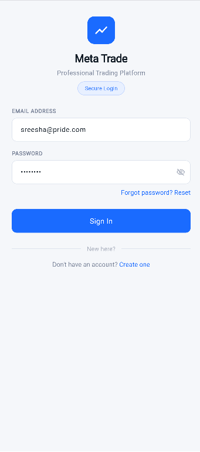
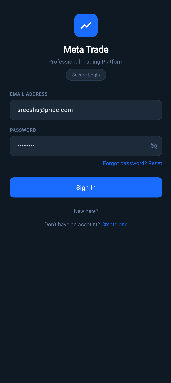
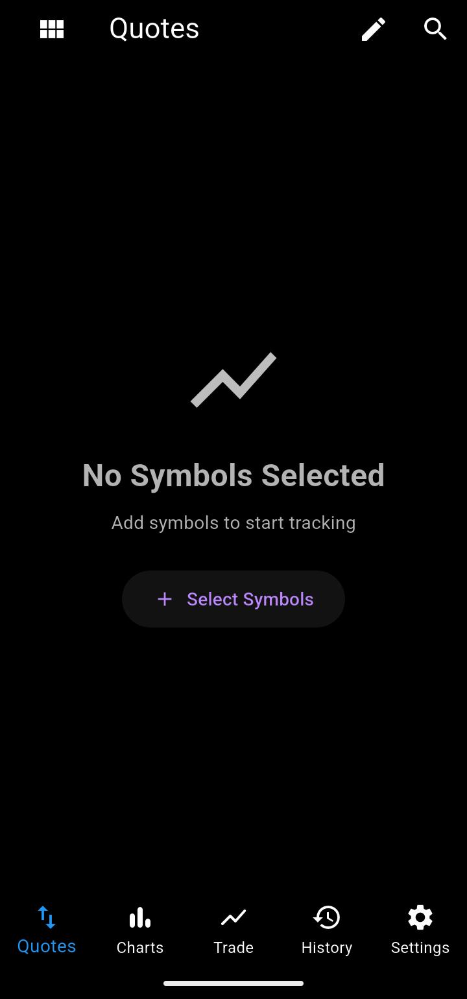
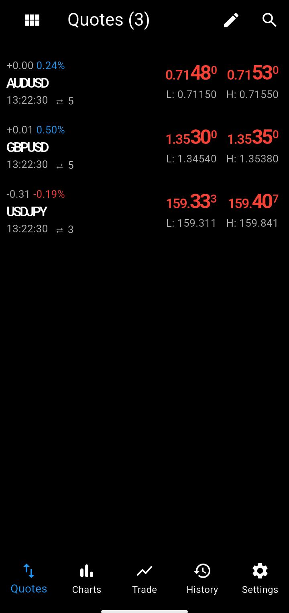
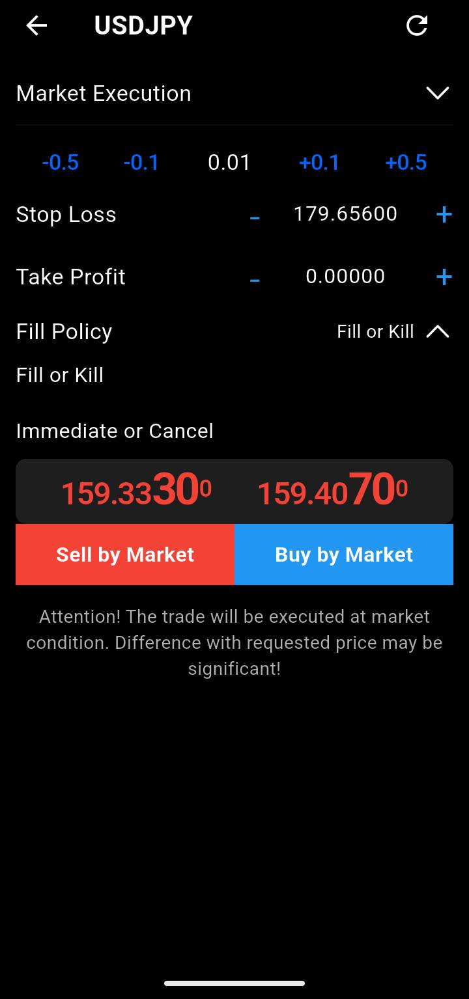
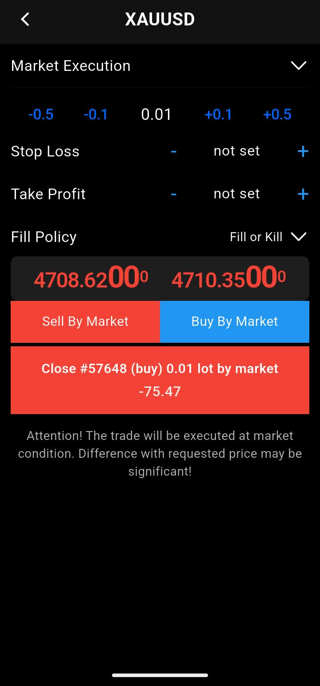
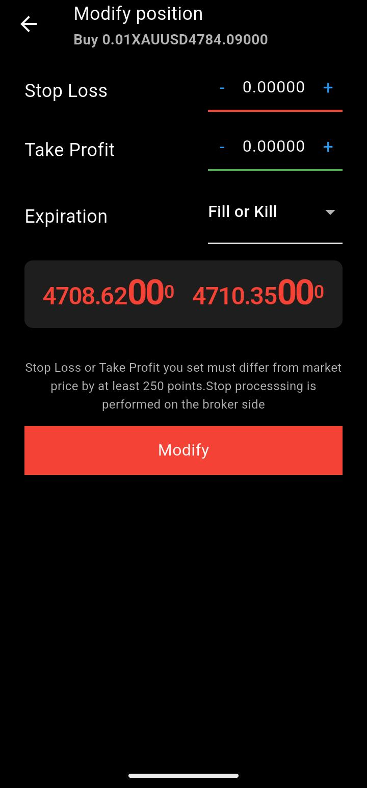
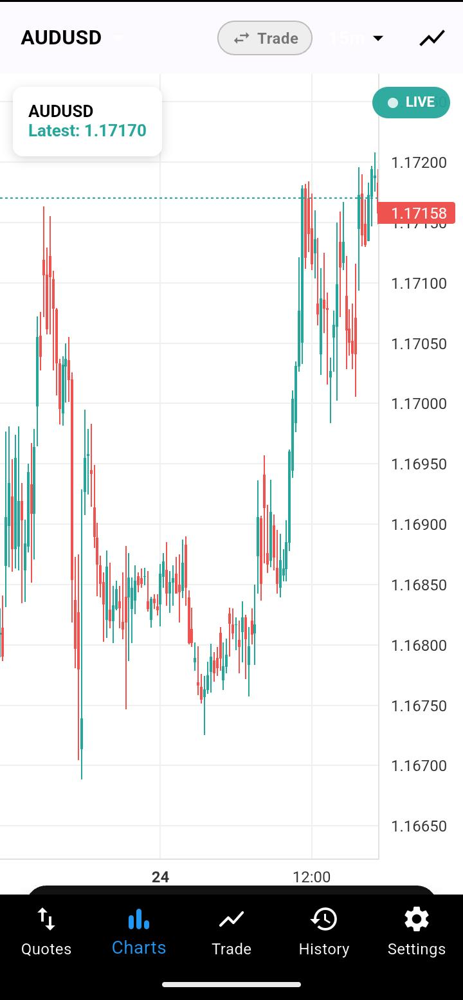

📈 Meta Trade — Flutter Trading App
A professional-grade mobile trading application built with Flutter, enabling real-time market tracking, order management, and portfolio monitoring through WebSocket-powered live data feeds.

🚀 Features

🔐 Authentication — Secure login with token-based auth
📊 Live Charts — TradingView-powered candlestick charts with indicators
📡 Real-Time Data — WebSocket integration for live price feeds
📋 Order Management — Place, modify, and cancel market/limit orders
💼 Position Tracking — Monitor open positions with live P&L
📁 Trade History — View closed positions, deals, and order history
💰 Wallet — Account balance and margin tracking
🔔 Notifications — Real-time trade alerts and updates
🌙 Theme Support — Light and dark mode
🔍 Symbol Search — Search and filter trading instruments

Screenshots
## 📸 Screenshots

  
  &nbsp;
  
  &nbsp;
  
  &nbsp;
  
  &nbsp;
  
  &nbsp;
  
  &nbsp;
  
  &nbsp;
  
  &nbsp;
  
  &nbsp;
  

🛠️ Tech Stack
Technology                  Usage
Flutter                  Cross-platform UI framework
Dart                     Programming language
GetX                     State management, routing & dependency injection
WebSocket                Real-time price and market data streaming
TradingView Charts       Candlestick charts via WebView
REST API                 Order placement, auth, and account data

📁 Project Structure
lib/
├── main.dart
├── app/
│   ├── config/
│   │   └── theme/          # App colors, text styles, theme
│   ├── core/
│   │   └── constants/      # URLs and app constants
│   ├── enums/              # Order type, time-in-force enums
│   ├── getX/               # GetX controllers
│   ├── models/             # Data models
│   ├── modules/            # Feature modules
│   │   ├── home/           # Home screen & symbol detail
│   │   ├── login/          # Authentication
│   │   ├── trade/          # Trading, positions, orders
│   │   ├── order/          # Place & manage orders
│   │   ├── history/        # Trade history
│   │   └── main_tab/       # Bottom navigation
│   ├── features/widgets/   # Reusable feature widgets
│   └── widgets/            # Shared widgets
├── screens/
│   ├── chart/              # Chart controller & WebView
│   ├── services/           # API & WebSocket services
│   ├── js/                 # JS bridge functions for charts
│   └── popup_pages/        # Search, quote, edit pages
└── utils/                  # Helpers & utilities

⚙️ Getting Started
Prerequisites

Flutter SDK >=3.0.0
Dart SDK >=3.0.0
Android Studio / VS Code
A running backend API server

Installation
bash# Clone the repository
git clone https://github.com/Sreesha-PV/meta_trading_app.git
# Navigate to project folder
cd meta-trade

# Install dependencies
flutter pub get

# Run the app
flutter run

📦 Key Dependencies
Package                    Purpose
get                     GetX state management
web_socket_channel      WebSocket connection
webview_flutter         TradingView chart rendering
http                    REST API calls
shared_preferences      Local data storage
